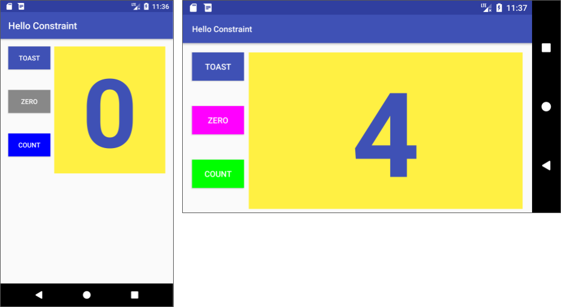

# HW2
This section lists possible homework assignments for students who are working through this codelab as part of a course led by an instructor. It's up to the instructor to do the following:
- Assign homework if required.
- Communicate to students how to submit homework assignments.
- Grade the homework assignments.

Instructors can use these suggestions as little or as much as they want, and should feel free to assign any other homework they feel is appropriate.

If you're working through this codelab on your own, feel free to use these homework assignments to test your knowledge.

## Change an app
Open the [HelloToast](https://github.com/google-developer-training/android-fundamentals-apps-v2/tree/master/HelloToast) app.
1. Change the name of the project to **HelloConstraint**, and refactor the project to `Hello Constraint`. (For instructions on how to copy and refactor a project, see [Appendix: Utilities](https://google-developer-training.github.io/android-developer-fundamentals-course-concepts-v2/appendix/appendix-utilities/appendix-utilities.html).)
2. Modify the `activity_main.xml` layout to align the **Toast** and **Count** `Button` elements along the left side of the `show_count` `TextView` that shows "0". Refer to the figures below for the layout.
3. Include a third `Button` called **Zero** that appears between the **Toast** and **Count** `Button` elements.
4. Distribute the `Button` elements vertically between the top and bottom of the `show_count` `TextView`.
5. Set the **Zero** `Button` to initially have a gray background.
6. Make sure that you include the **Zero** `Button` for the landscape orientation in `activity_main.xml (land)`, and also for a tablet-sized screen in `activity_main (xlarge)`.
7. Make the **Zero** `Button` change the value in the `show_count` `TextView` to 0.
8. Update the click handler for the **Count** `Button` so that it changes its own background color, depending on whether the new count is odd or even.
Hint: Don't use `findViewById` to find the **Count** `Button`. Is there something else you can use?

Feel free to to use constants in the [`Color`](https://developer.android.com/reference/android/graphics/Color.html) class for the two different background colors.

9. Update the click handler for the **Count** `Button` to set the background color for the **Zero** `Button` to something other than gray to show it is now active. Hint: You can use `findViewById` in this case.
10. Update the click handler for the **Zero** `Button` to reset the color to gray, so that it is gray when the count is zero.



## Answer these questions
### Question 1
Which two layout constraint attributes on the **Zero** `Button` position it vertically equal distance between the other two `Button` elements? (Pick 2 answers.)
- [X] `app:layout_constraintBottom_toTopOf="@+id/button_count"`
- [ ] `android:layout_marginBottom="8dp"`
- [ ] `android:layout_marginStart="16dp"`
- [X] `app:layout_constraintTop_toBottomOf="@+id/button_toast"`
- [ ] `android:layout_marginTop="8dp"`

### Question 2
Which layout constraint attribute on the **Zero** `Button` positions it horizontally in alignment with the other two `Button` elements?
- [X] `app:layout_constraintLeft_toLeftOf="parent"`
- [ ] `app:layout_constraintBottom_toTopOf="@+id/button_count"`
- [ ] `android:layout_marginBottom="8dp"`
- [ ] `app:layout_constraintTop_toBottomOf="@+id/button_toast"`

### Question 3
What is the correct signature for a method used with the `android:onClick` XML attribute?
- [ ] `public void callMethod()`
- [X] `public void callMethod(View view)`
- [ ] `private void callMethod(View view)`
- [ ] `public boolean callMethod(View view)`

### Question 4
The click handler for the **Count** `Button` starts with the following method signature:
```java
public void countUp(View view)
```
Which of the following techniques is more efficient to use within this handler to change the `Button` element's background color? Choose one:
- [ ] Use `findViewById` to find the **Count** `Button`. Assign the result to a `View` variable, and then use [`setBackgroundColor()`](https://developer.android.com/reference/android/view/View.html#setBackgroundColor(int)).
- [X] Use the `view` parameter that is passed to the click handler with `setBackgroundColor(): view.setBackgroundColor()`.

## Submit your app for grading
### Guidance for graders
Check that the app has the following features:
- It displays the **Zero** button.
- The **Zero** button is between the **Toast** and **Count** buttons.
- The app includes an implementation of `activity_main.xml`, `activity_main.xml (land)`, and `activity_main.xml (xlarge)`.
- The app includes an implementation of the click handler method for the **Zero** button to reset the count to 0. The method must show the zero count in the `show_count` `TextView`. The click handler must also reset the **Zero** button's own background color to gray.
- The click handler method for the **Count** button has been updated to change its own background color depending on whether the new count is odd or even. This method must use the `view` parameter to access the button. This method must also change the background of the **Zero** button to a color other than gray.
